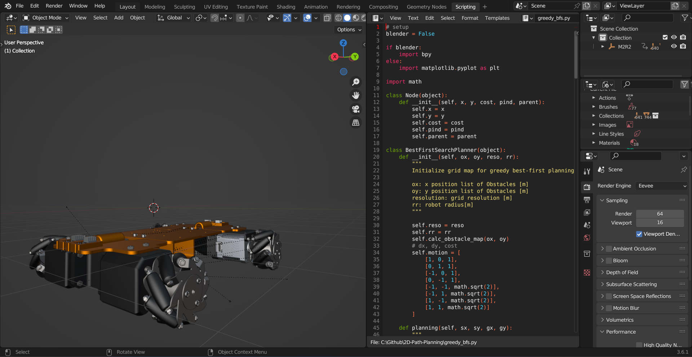

# Blender 2D Mobile Robot M2R2

As a part of 0MR workshops, this project was carried out to demonstrate the use of Blender software and the implementation of the path planner solver. The main parts:

* Greedy Best-First-Search for path planning
* Visualisation of the animation result

Visualisation of the blender Scripting development environment:

 

:red_circle: Brno University of Technology,

:large_blue_circle: Faculty of Mechanical Engineering,

:computer: Institute of Automation and Computer Science
